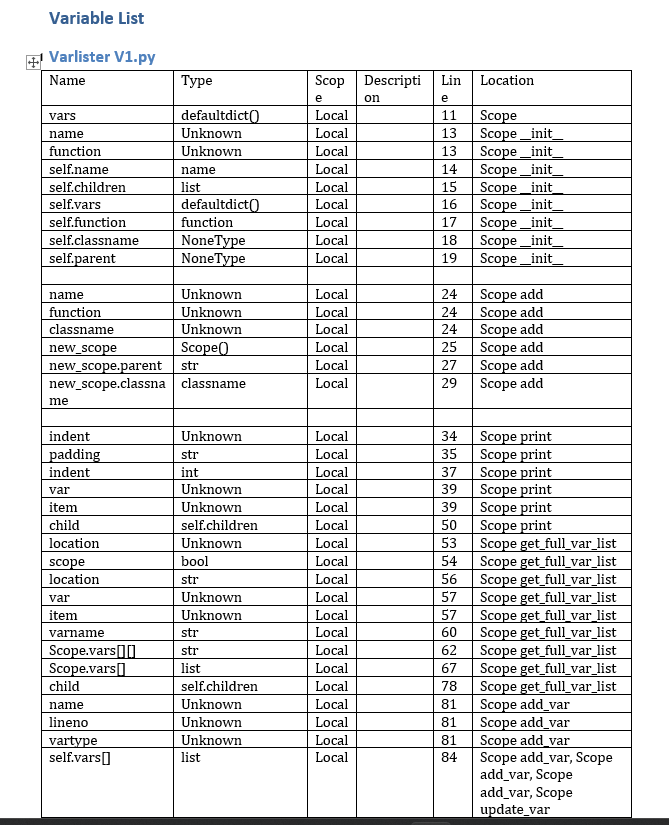

# Python Variable Lister
A project in python using [Abstract Syntax Tree](https://docs.python.org/3/library/ast.html) to guess they type of variables and generate a description for each variable.

## Features
- Finds every file in the directory tree
- Finds all identifiers and generates a description of its name type, scope and location
- Guess the variable type based on the return type of functions and occurances of the same variable in the program

## Example

